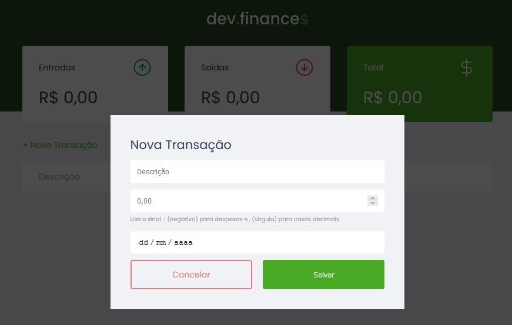

<div align="center" id="top"> 
  

&#xa0;

</div>

<h1 align="center">Maratona Discover</h1>

<p align="center">
  

  

  

</p>

Status

<h4 align="center">
	🚧  Maratona Discover 🚀 Under construction...  🚧
</h4>

<hr>

<p align="center">
  <a href="#dart-about">About</a> &#xa0; | &#xa0; 
  <a href="#sparkles-features">Features</a> &#xa0; | &#xa0;
  <a href="#rocket-technologies">Technologies</a> &#xa0; | &#xa0;
  <a href="#white_check_mark-requirements">Requirements</a> &#xa0; | &#xa0;
  <a href="#checkered_flag-starting">Starting</a> &#xa0; | &#xa0;
  <a href="https://github.com/luis-jr-zembruski" target="_blank">Author</a>
</p>

<br>

## :dart: About

It is an application to control the finances. including income and expenses.
Only HTML, CSS and Javascript were used for this project.

## :sparkles: Features

:heavy_check_mark: Control your finances;\

:heavy_check_mark: New Transaction;\

:heavy_check_mark: Operations;


## :rocket: Technologies

The following tools were used in this project:

- [HTML5](https://developer.mozilla.org/pt-BR/docs/Web/HTML)
- [CSS3](https://developer.mozilla.org/pt-BR/docs/Web/CSS)
- [Javascript](https://developer.mozilla.org/pt-BR/docs/Web/JavaScript)

## :white_check_mark: Requirements

Before starting :checkered_flag:, you need to have [Git](https://git-scm.com) installed.

## :checkered_flag: Starting

```bash
# Clone this project
$ git clone https://github.com/luis-jr-zembruski/maratona-discover

# Access
$ cd maratona-discover
```

Made with :heart: by <a href="https://github.com/{{YOUR_GITHUB_USERNAME}}" target="_blank">Luís Jr. R. Zembruski</a>

&#xa0;

<a href="#top">Back to top</a>
